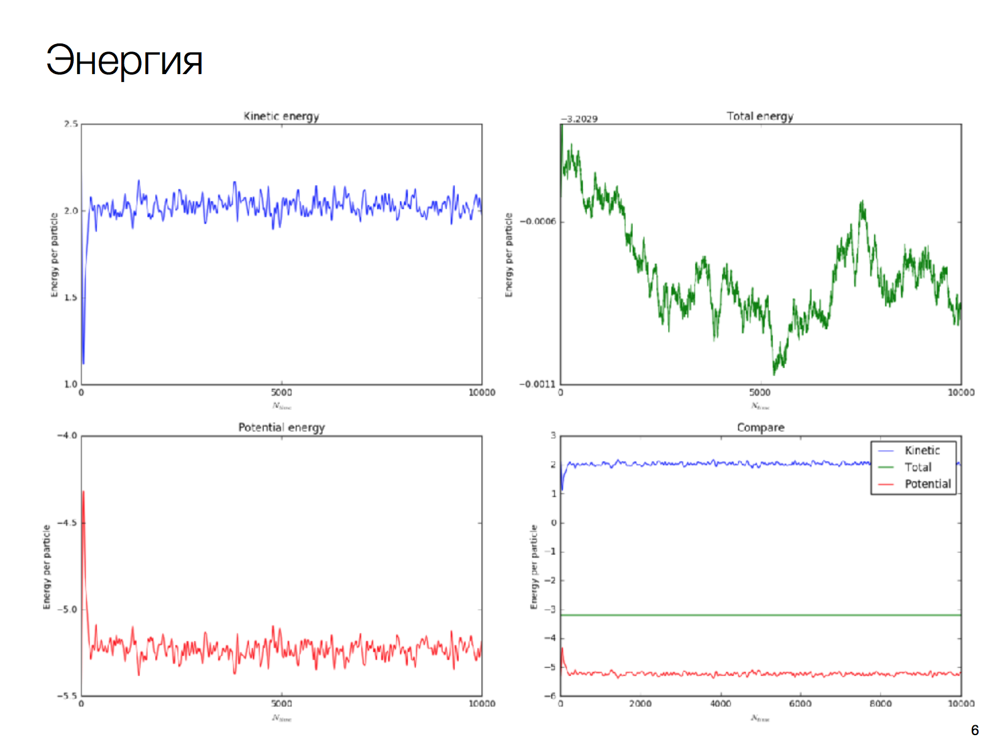
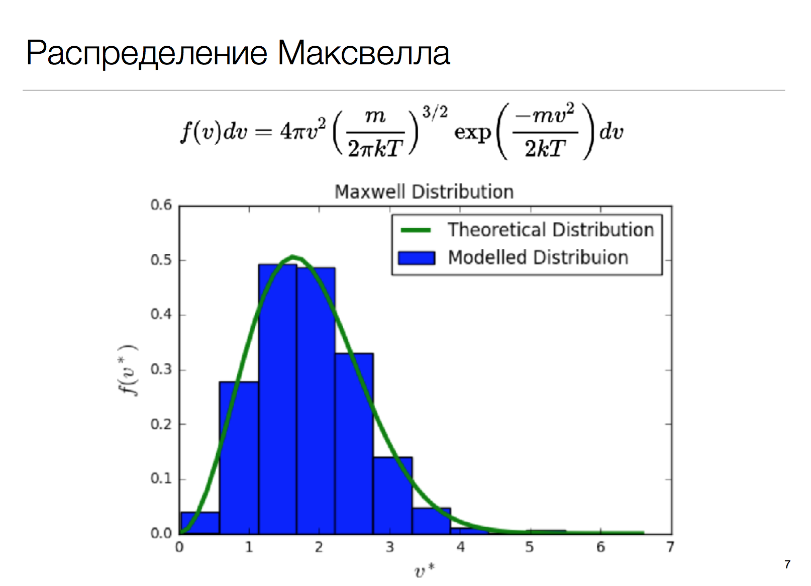
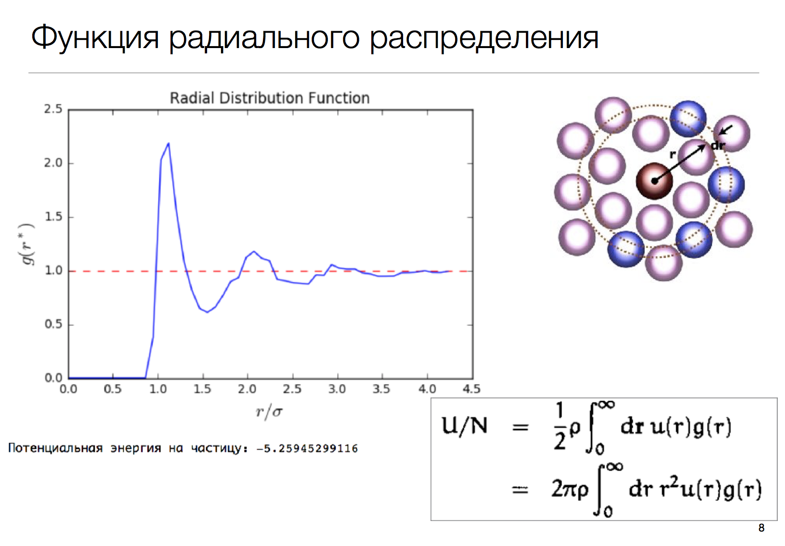
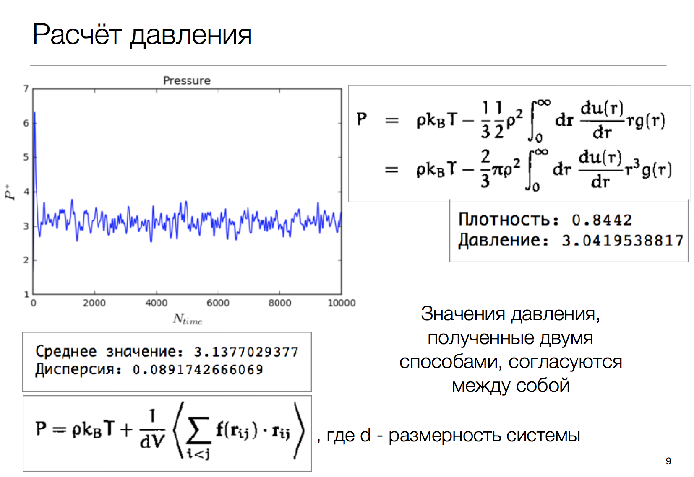
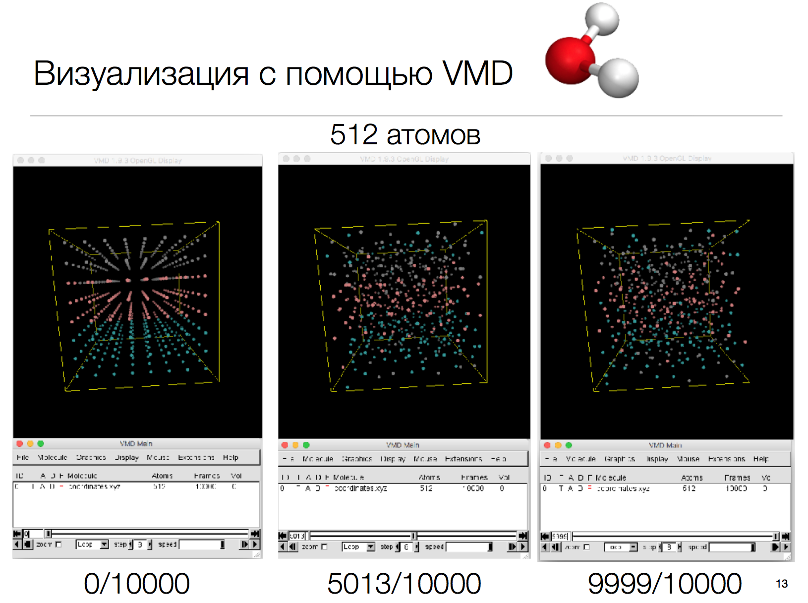

# Molecular-Dynamics of Lennard-Jones fluid

[Presentation](presentation.pdf)

## Literature
- Прут Э.В., Кленов С.В., Овсянникова О.Б. Элементы теории флуктуаций и броуновского движения в молекулярной физике - М.: МФТИ, 2002.
- Frenkel D., Smit B. Understanding Molecular Simulation. From Algorithms to Applications - Academic Press, 2002.

|      |      |
| :------------- | :------------- |
|       |        |
|  | |
